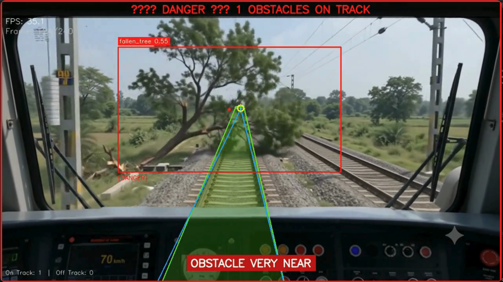
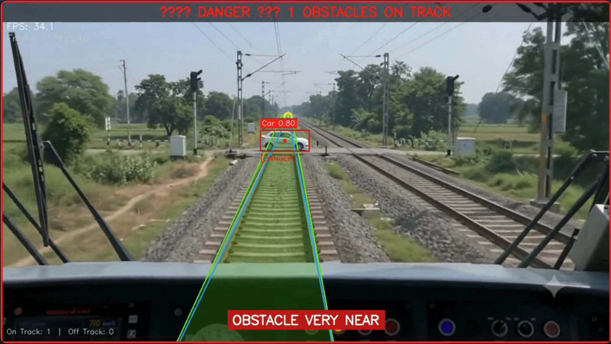
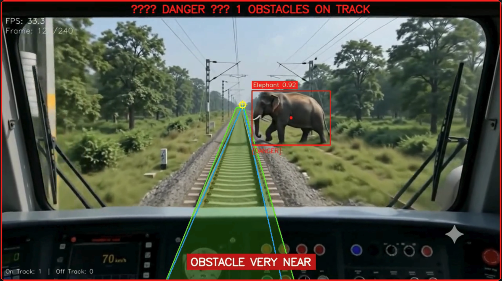

<h1 align="center">🚂 RailSafe Vision</h1>

<div align="center">
  
  
  
  
</div>


<p align="center">
  <b>A highly optimized, geometry-aware real-time computer vision pipeline designed to prevent railway accidents by detecting fallen trees, vehicles, animals, and other obstacles on tracks.</b>
</p>

---

## 📸 System Inference

### Obstacle Detection & Active Track ROI Segmentation

<p align="center">
  <br>
  <i>Figure 1: Custom YOLOv11s model detecting a fallen tree obstacle directly overlapping with the active track ROI.</i>
</p>

<p align="center">
  <br>
  <i>Figure 2: COCO model detecting a vehicle crossing. Note the tight geometric green track ROI isolating the train's active line.</i>
</p>

<p align="center">
  <br>
  <i>Figure 3: System state indicating "TRACK CLEAR" when the rails are free of any obstruction.</i>
</p>

---

## 🚀 The Problem

Trains operate at high speeds and require immensely long stopping distances. If an obstacle—such as a fallen tree, a stalled vehicle, or wandering livestock—blocks the track, the train engineer needs to be alerted **immediately** to engage emergency brakes.

Traditional object detection systems analyze the entire frame, leading to constant **false alarms** from objects safely off to the side of the tracks (such as trees in a forest or cars on an adjacent road).

## 💡 The Solution

**RailSafe Vision** introduces a robust **Geometry & AI-Aware Pipeline** that specifically isolates the active railway track (Region of Interest) and cross-references dual AI models to accurately classify obstacles as either `DANGER` (on the active track) or `SAFE` (off the track).

It intelligently ignores adjacent parallel tracks, trackside foliage, and passing vehicles, only triggering safety alerts when an object's bounding box directly intersects with the dynamic track ROI mask.

---

## 🏗️ Architecture & Pipeline Workflow

The pipeline is entirely modular and split into 5 core architectural components:

1. **Dual YOLO Detection (`yolo_detector.py`)**
   - Runs two YOLOv11 models concurrently on the incoming frame.
   - **Model 1**: A custom-trained YOLOv11s model specifically optimized to detect **Fallen Trees**.
   - **Model 2**: The official COCO YOLOv11s model configured to detect standard obstacles (Vehicles, Animals, etc.).
2. **Cross-Model NMS (`detection_merger.py`)**
   - Applies Intersection-over-Union (IoU) deduplication to smoothly merge bounding boxes from both models, preventing duplicate or overlapping detections.
3. **Track ROI Generation (`track_detector.py`)**
   - Dynamically calculates a highly precise trapezoidal Region of Interest (ROI) mask using local OpenCV processing.
   - Integrates Gaussian filters, Canny edge detection, and Hough Line Transforms.
   - Utilizes custom camera-projection filtering (`x_bottom` boundaries) to isolate the active rail track from adjacent tracks and fits representative lines to estimate the vanishing point.
4. **Proximity Alert Logic (`roi_analyzer.py`)**
   - Performs a highly efficient mask-based overlap calculation. If a detected obstacle's bounding box intersects with the green track ROI mask, it triggers a `🚨 DANGER` (near) or `WARNING` (far) alert.
5. **HUD Visualizer (`visualizer.py`)**
   - Renders a professional Heads-Up Display showing color-coded bounding boxes, FPS counters, and dynamic flashing warning banners.

---

## 📥 Download Custom Model

The custom-trained YOLOv11s model for detecting **Fallen Trees** is available for download:

<a href="https://drive.google.com/file/d/1YHbc3T2hafmxtfXd7ApFgXOP3be-GpG-/view?usp=sharing" target="_blank">
  
</a>

Place the downloaded `best.pt` file inside the `models/` directory of the project.

---

## ⚙️ Installation & Usage
### 1. Clone the Repository
```bash
git clone https://github.com/anilsjr/RailSafe-Vision.git
cd RailSafe-Vision
```

### 2. Install Dependencies
```bash
pip install -r requirements.txt
```

### 3. Run the Inference Pipeline
Ensure your video and model paths are correctly configured in `.env` (or `config.py`), then run:
```bash
python run_inference.py
```
The processed video will be saved in the `output/` directory.

---

## 🛠️ Configuration & Tuning

You can fine-tune the detection parameters inside [config.py](/config.py):
* **YOLO Settings**: `YOLO_CONFIDENCE_THRESHOLD` (default: `0.35`) and `YOLO_NMS_IOU_THRESHOLD` (default: `0.45`).
* **Rail Angle Filter**: `RAIL_MIN_ANGLE_DEG` and `RAIL_MAX_ANGLE_DEG` to tune candidate line slopes.
* **Proximity Alert**: `DANGER_Y_THRESHOLD_FRACTION` controls the warning-to-danger transition height.
